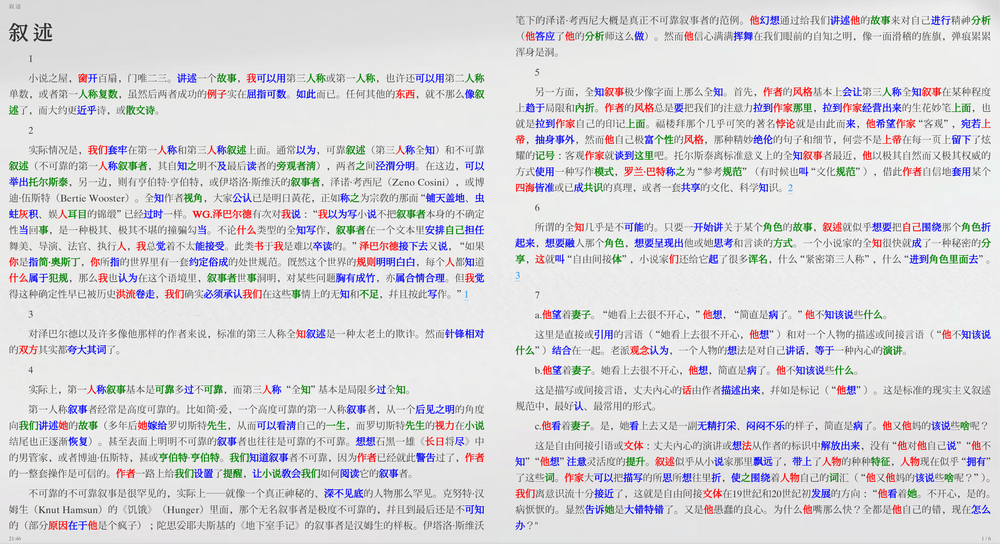

# bioCN

中文仿生阅读 EPUB 处理器，基于 HanLP 语法分析实现。

## 功能简介

bioCN 是一个为中文 EPUB 电子书增强阅读体验的工具。它通过使用自然语言处理分析中文句子结构，然后用不同的颜色标注主谓宾的方式帮助提升中文阅读效率。



## 安装

### 前置要求

- Python 3.10+

### 1. 使用 pip 安装

这种方式会将 `bioCN` 安装为命令行工具，适合直接使用。

#### GPU 环境 (默认)
```bash
# pip 会自动安装 torch，并优先使用 GPU 版本（如果环境支持）
pip install git+https://github.com/asinkLuno/bioCN.git
```

#### 纯 CPU 环境
```bash
# 通过指定 Pytorch 的 CPU-only 索引来强制安装纯 CPU 版本
pip install --index-url https://download.pytorch.org/whl/cpu git+https://github.com/asinkLuno/bioCN.git
```

### 2. 使用 uv 开发安装

这种方式适合需要修改代码或进行二次开发的场景。

**首先**，克隆本仓库并进入项目目录：
```bash
git clone https://github.com/asinkLuno/bioCN.git
cd bioCN
```

**然后**，根据您的环境选择对应的命令安装依赖：

#### GPU 环境 (默认)
```bash
# 安装基础依赖
uv pip install -e .

# 安装基础依赖 + 开发依赖
uv pip install -e '.[dev]'
```

#### 纯 CPU 环境
```bash
# 安装基础依赖
uv pip install --index-url https://download.pytorch.org/whl/cpu -e .

# 安装基础依赖 + 开发依赖
uv pip install --index-url https://download.pytorch.org/whl/cpu -e '.[dev]'
```

## 使用方法

### pip 安装后使用

```bash
# 处理 EPUB 文件（自动生成输出路径）
biocn --input-path your-book.epub

# 指定输出路径
biocn --input-path your-book.epub --output-path processed-book.epub
```

### uv 开发环境使用

```bash
# 处理 EPUB 文件
uv run biocn --input-path your-book.epub

# 或者使用模块方式
uv run python -m src.cli --input-path your-book.epub
```

### 输出规则

如果不指定 `--output-path`，工具会在输入文件同目录下生成 `原文件名_bio.epub`。

### 示例

```bash
# 处理 故事新编.epub，生成故事新编_bio.epub
# pip 安装后：
biocn --input-path 故事新编.epub

# uv 开发环境：
uv run biocn --input-path tests/故事新编.epub
```

## 技术原理

### 核心组件

1. **EpubParser**：解析 EPUB 文件，提取文本内容
2. **ChineseAnalyzer**：使用 HanLP 进行中文语法分析
3. **CLI 界面**：提供友好的命令行交互和进度显示

### 语法分析

基于 HanLP 的语义角色标注（SRL）技术：
- 自动识别句子中的主谓宾结构
- 支持复杂句子的多谓语分析
- 准确提取中文语法成分

### 标记规则

- **主语**：`<span style="color: #D95F02; font-weight: bold;">文本</span>`
- **谓语**：`<span style="color: #1B9E77; font-weight: bold;">文本</span>`
- **宾语**：`<span style="color: #7570B3; font-weight: bold;">文本</span>`

## 开发

### 运行测试

```bash
# 运行所有测试
uv run pytest

# 运行特定测试
uv run pytest tests/test_cli.py
```

### 代码格式化

```bash
# 格式化所有代码
./format_all.sh
```

### 项目结构

```
bioCN/
├── src/
│   ├── cli.py          # 命令行界面
│   ├── analyzer.py     # 中文语法分析器
│   └── epub_parser.py  # EPUB 文件解析器
├── tests/
│   ├── test_cli.py     # CLI 测试
│   └── *.epub         # 测试用 EPUB 文件
├── pyproject.toml      # 项目配置
└── README.md          # 本文档
```

## 依赖

- **click**: 命令行界面框架
- **ebooklib**: EPUB 文件处理
- **beautifulsoup4**: HTML 解析
- **hanlp**: 中文自然语言处理
- **rich**: 终端美化

## 注意事项

1. **包发布状态**：bioCN 尚未发布到 PyPI，请使用 `pip install git+https://github.com/asinkLuno/bioCN.git` 从源码安装
2. **首次运行**：HanLP 会自动下载预训练模型，需要网络连接
3. **处理时间**：大型 EPUB 文件可能需要几分钟处理时间
4. **兼容性**：仅支持标准 EPUB 格式
5. **语言支持**：专门针对中文文本设计

## 许可证

本项目采用 MIT 许可证。详见 [LICENSE](LICENSE) 文件。

## 贡献

欢迎提交 Issue 和 Pull Request！

## 遗留问题

### 1. 大文件性能问题

**问题描述**：处理后的 EPUB 文件在某些阅读器中打开大文件时会明显卡顿。

**根本原因**：当前 CSS 嵌入方式不够优化，每个处理的文本片段都包含了内联样式，导致：

- HTML 体积膨胀
- 阅读器渲染压力大
- 滚动和翻页响应慢

**计划优化方案**：
- 将样式集中到 CSS 文件中，通过 class 选择器应用
- 减少内联样式的数量
- 考虑按章节分割处理，避免单文件过大

### 2. 主谓宾提取算法准确性

**问题描述**：当前的主谓宾提取算法（基于 HanLP 的语义角色标注）在实际阅读中存在错误识别的情况。

**根本原因**：算法是 vibe coding 快速实现的，未经过充分的测试和优化，存在以下问题：

- 复杂句式处理不当
- 兼语句、连动句等特殊句式识别错误
- 省略成分的句子处理能力弱
- 语义角色标注的边界不够准确

**改进方向**：
- 基于依存句法分析重新设计提取逻辑
- 增加中文特殊句式的处理规则
- 收集实际阅读中的错误案例进行针对性优化
- 考虑引入更多语言学知识提升准确率

## 相关链接

- [HanLP 官方文档](https://hanlp.hankcs.com/)
- [Bionic Reading 概念](https://bionic-reading.com/)
- [EPUB 规范](https://www.w3.org/publishing/epub3/)
