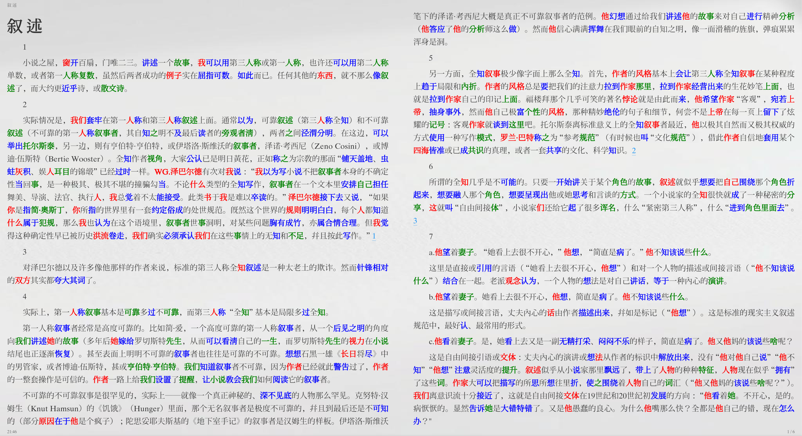

# bioCN

中文仿生阅读 EPUB 处理器，基于 HanLP 语法分析实现。

## 功能简介

bioCN 是一个为中文 EPUB 电子书增强阅读体验的工具。它通过使用自然语言处理分析中文句子结构，然后用不同的颜色标注主谓宾的方式帮助提升中文阅读效率。



## 安装

### 前置要求

- Python 3.13+

### 1. 使用 pip 安装

这种方式会将 `bioCN` 安装为命令行工具，适合直接使用。

```bash
# GPU 环境（默认，安装含 CUDA 的 torch）
pip install git+https://github.com/asinkLuno/bioCN.git[gpu]

# 纯 CPU 环境
pip install --index-url https://download.pytorch.org/whl/cpu git+https://github.com/asinkLuno/bioCN.git[cpu]
```

### 2. 使用 uv 开发安装

这种方式适合需要修改代码或进行二次开发的场景。

**首先**，克隆本仓库并进入项目目录：

```bash
git clone https://github.com/asinkLuno/bioCN.git
cd bioCN
```

**然后**，根据您的环境选择对应的命令安装依赖：

```bash
# GPU 环境（默认，安装含 CUDA 的 torch）
uv sync --extra gpu

# GPU 环境 + 开发依赖
uv sync --extra gpu --extra dev

# 纯 CPU 环境
uv sync --extra cpu --index-url https://download.pytorch.org/whl/cpu

# 纯 CPU 环境 + 开发依赖
uv sync --extra cpu --extra dev --index-url https://download.pytorch.org/whl/cpu
```

## 使用方法

### pip 安装后使用

```bash
# 处理 EPUB 文件（自动生成输出路径，默认使用内联CSS）
biocn --input-path your-book.epub

# 指定输出路径
biocn --input-path your-book.epub --output-path processed-book.epub

# 使用外部CSS样式表（推荐用于大文件）
biocn --input-path your-book.epub --no-inline-css

# 指定输出路径并使用外部CSS
biocn --input-path your-book.epub --output-path processed-book.epub --no-inline-css
```

### uv 开发环境使用

```bash
# 处理 EPUB 文件
uv run biocn --input-path your-book.epub

# 使用外部CSS样式表
uv run biocn --input-path your-book.epub --no-inline-css

# 或者使用模块方式
uv run python -m src.cli --input-path your-book.epub

# 模块方式使用外部CSS
uv run python -m src.cli --input-path your-book.epub --no-inline-css
```

### 输出规则

如果不指定 `--output-path`，工具会在输入文件同目录下生成 `原文件名_bio.epub`。

### CSS 样式选项

工具提供两种 CSS 应用模式：

- **内联样式（默认）**：每个 SVO 成分使用内联 `style` 属性，兼容性最好
- **外部CSS（--no-inline-css）**：使用 CSS 类选择器，文件更小，性能更好

**推荐选择**：

- 小文件或追求最大兼容性：使用默认内联样式
- 大文件或注重性能：使用 `--no-inline-css`

### 示例

```bash
# 处理 故事新编.epub，生成故事新编_bio.epub
# pip 安装后：
biocn --input-path 故事新编.epub

# 使用外部CSS处理大文件：
biocn --input-path 故事新编.epub --no-inline-css

# uv 开发环境：
uv run biocn --input-path tests/故事新编.epub

# uv 环境使用外部CSS：
uv run biocn --input-path tests/故事新编.epub --no-inline-css
```

## 技术原理

### 核心组件

1. **EpubParser**：解析 EPUB 文件，提取文本内容
1. **ChineseAnalyzer**：使用 HanLP 进行中文语法分析
1. **CLI 界面**：提供友好的命令行交互和进度显示

### 语法分析

基于 HanLP 三模型联合 pipeline（分词 + 语义角色标注 + 词性标注）：

- **SRL 语义角色标注**：自动识别句子中的主谓宾结构，支持多谓语分析
- **POS 词性过滤**：仅标注动词性谓语（VV/VC/VE），跳过形容词谓语误标
- **定语裁剪**：通过 DEG/DEC 标记自动跳过"的"字结构等定语修饰，仅标注核心名词
- **字符级标注**：按 token offset 精确标注，消除子串误匹配

### 标记规则

工具提供两种 CSS 标记模式：

#### 内联样式模式（默认）

- **主语**：`<span style="color: #D95F02; font-weight: bold;">文本</span>`
- **谓语**：`<span style="color: #1B9E77; font-weight: bold;">文本</span>`
- **宾语**：`<span style="color: #7570B3; font-weight: bold;">文本</span>`

#### 外部CSS模式（--no-inline-css）

- **主语**：`<span class="svo-subject">文本</span>`
- **谓语**：`<span class="svo-predicate">文本</span>`
- **宾语**：`<span class="svo-object">文本</span>`

外部CSS模式会自动注入包含以下样式的CSS文件：

```css
.svo-subject { color: #D95F02; font-weight: bold; }
.svo-predicate { color: #1B9E77; font-weight: bold; }
.svo-object { color: #7570B3; font-weight: bold; }
```

## 开发

### 运行测试

```bash
# 运行所有测试
uv run pytest

# 运行特定测试
uv run pytest tests/test_cli.py
```

### 代码格式化

```bash
# 格式化所有代码
./format_all.sh
```

### 项目结构

```
bioCN/
├── src/
│   ├── cli.py          # 命令行界面
│   ├── analyzer.py     # 中文语法分析器
│   └── epub_parser.py  # EPUB 文件解析器
├── tests/
│   ├── test_cli.py     # CLI 测试
│   └── *.epub         # 测试用 EPUB 文件
├── pyproject.toml      # 项目配置
└── README.md          # 本文档
```

## 依赖

- **click**: 命令行界面框架
- **ebooklib**: EPUB 文件处理
- **beautifulsoup4**: HTML 解析
- **hanlp**: 中文自然语言处理
- **rich**: 终端美化

## 注意事项

1. **包发布状态**：bioCN 尚未发布到 PyPI，请使用 `pip install git+https://github.com/asinkLuno/bioCN.git` 从源码安装
1. **首次运行**：HanLP 会自动下载预训练模型，需要网络连接
1. **处理时间**：大型 EPUB 文件可能需要几分钟处理时间
1. **兼容性**：仅支持标准 EPUB 格式
1. **语言支持**：专门针对中文文本设计

## 许可证

本项目采用 MIT 许可证。详见 [LICENSE](LICENSE) 文件。

## 贡献

欢迎提交 Issue 和 Pull Request！

## 遗留问题

### 1. 大文件性能问题 ✅ 已部分解决

**问题描述**：处理后的 EPUB 文件在某些阅读器中打开大文件时会明显卡顿。

**根本原因**：默认的内联 CSS 嵌入方式导致 HTML 体积膨胀，增加了阅读器的渲染负担。

**✅ 已实现解决方案**：

- 新增 `--no-inline-css` 选项，使用外部 CSS 类选择器替代内联样式
- 外部 CSS 模式显著减少文件大小，提升渲染性能
- 为大文件处理推荐使用 `--no-inline-css` 模式

**后续优化方向**：

- 考虑按章节分割处理，避免单文件过大
- 优化 CSS 注入方式，进一步减少文件体积

### 2. 主谓宾提取算法准确性 ✅ 已部分解决

**问题描述**：当前的主谓宾提取算法在实际阅读中存在错误识别的情况。

**✅ 已实现改进**：

- 从单一 MTL 模型升级为 TOK + SRL + POS 三模型联合 pipeline
- POS 词性过滤：仅标注动词性谓语（VV/VC/VE），消除形容词谓语误标
- 定语裁剪：通过 DEG/DEC 标记跳过"的"字结构等定语，只标注核心名词
- 字符级 token offset 标注替代子串匹配，消除文本误匹配

**遗留问题**：

- 兼语句、连动句等复杂句式识别有限
- 省略成分的句子处理能力弱
- SRL 模型自身的语义角色边界偏差

## 相关链接

- [HanLP 官方文档](https://hanlp.hankcs.com/)
- [Bionic Reading 概念](https://bionic-reading.com/)
- [EPUB 规范](https://www.w3.org/publishing/epub3/)
